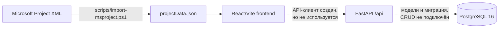
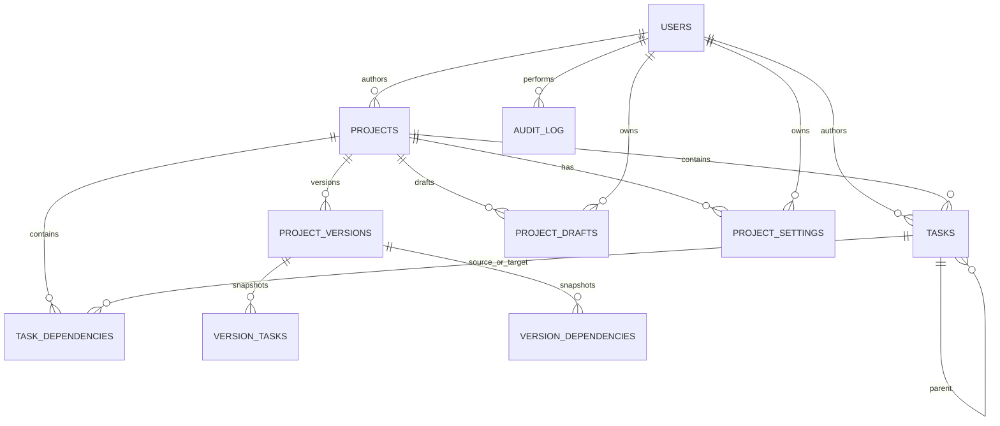

# TimeLiner — техническая документация

**Состояние проекта:** 12 июля 2026 года  
**Версия приложения:** `0.1.0`  
**Статус:** MVP / функциональный прототип просмотрщика графика Ганта

## 1. Назначение

TimeLiner — внутреннее веб-приложение для просмотра и последующего ведения календарных графиков проектов. Целевая модель продукта предусматривает работу с иерархией задач, диаграммой Ганта, черновиками, неизменяемыми версиями графика и сравнением версий.

В текущей реализации полностью доступен клиентский просмотр графика, импортированного из Microsoft Project XML. Серверная модель данных и API созданы как задел для дальнейшей разработки, но frontend с ними пока не интегрирован, а большинство серверных операций являются заглушками.

## 2. Текущее состояние

### Реализовано

- отображение таблицы задач и синхронизированной диаграммы Ганта;
- отображение обычных, суммарных задач и вех;
- пять масштабов шкалы: день, неделя, месяц, квартал и год;
- поиск по названию задачи и коду WBS;
- фильтр критических задач;
- ограничение отображаемого диапазона дат ползунками или полями дат;
- синхронная вертикальная прокрутка таблицы и временной шкалы;
- изменение ширины таблицы мышью или клавиатурой;
- переход к началу выбранной задачи на временной шкале;
- карточка задачи со сроками, прогрессом, родительской задачей и предшественниками;
- импорт Microsoft Project XML в статический JSON;
- SQLAlchemy-модели и начальная Alembic-миграция целевой БД;
- чистая функция сравнения снимков задач и один unit-тест;
- health-check и каркас REST API.

### Частично реализовано

- создание проекта: `POST /api/projects` валидирует запрос и формирует ответ, но не сохраняет данные;
- сравнение версий: алгоритм сравнения существует в сервисном слое, но маршрут API к нему не подключён;
- версии, черновики, настройки, аудит и задачи описаны моделями БД, но CRUD и бизнес-логика отсутствуют.

### Не реализовано

- загрузка данных frontend через API;
- редактирование задач и зависимостей;
- сохранение пользовательского черновика;
- создание, удаление, восстановление и назначение основной версии;
- экран истории и визуальное сравнение версий;
- импорт XML через пользовательский интерфейс или backend;
- аутентификация, авторизация и разграничение ролей;
- серверная пагинация, фильтрация и обработка больших графиков;
- генератор тестовых наборов на 100/1000/5000 задач;
- production-сборка и production web-сервер для frontend.

Кнопки «Сохранить версию», «Версии» и «Сравнить» в верхней панели намеренно отключены.

## 3. Архитектура



Приложение состоит из трёх контейнеризуемых компонентов:

| Компонент | Технологии | Порт | Фактическая роль |
|---|---|---:|---|
| Frontend | React 18, TypeScript 5.6, Vite 5, Zustand | 5173 | Рабочий автономный просмотрщик статического JSON |
| Backend | Python 3.12, FastAPI, SQLAlchemy 2, Pydantic 2 | 8000 | Каркас API и доменной модели |
| Database | PostgreSQL 16 | 5432 | Целевая БД; frontend её данные не использует |

### Поток данных в текущем стенде

1. PowerShell-скрипт читает XML Microsoft Project.
2. Результат записывается в `frontend/src/data/projectData.json`.
3. Vite включает JSON в клиентский bundle во время сборки.
4. `App.tsx` передаёт данные в `GanttWorkspace`.
5. Компоненты фильтруют и визуализируют данные в памяти браузера.

Изменение JSON требует повторной сборки или перезапуска dev-сервера. Данные не записываются в PostgreSQL.

## 4. Структура репозитория

```text
gantt-app/
├── backend/
│   ├── app/
│   │   ├── api/routes/       # REST-маршруты
│   │   ├── core/             # конфигурация и подключение к БД
│   │   ├── models/           # ORM-модели
│   │   ├── schemas/          # Pydantic-схемы
│   │   └── services/         # сравнение снимков версий
│   ├── migrations/           # Alembic
│   └── tests/                # pytest
├── frontend/
│   └── src/
│       ├── api/              # минимальный HTTP-клиент
│       ├── components/       # оболочка, таблица, timeline, drawer
│       ├── data/             # импортированный график
│       ├── store/            # Zustand UI state
│       └── types/            # клиентская доменная модель
├── scripts/
│   ├── import-msproject.ps1
│   └── generate_test_data/   # пока только описание будущего генератора
├── docker-compose.yml
├── start-dev.ps1
└── stop-dev.ps1
```

## 5. Frontend

### Основные компоненты

| Компонент | Ответственность |
|---|---|
| `App` | Загружает встроенный `projectData.json` и создаёт рабочую область |
| `AppShell` | Заголовок приложения и отключённые действия с версиями |
| `GanttWorkspace` | Поиск, фильтры, масштаб, диапазон, splitter и синхронизация прокрутки |
| `TaskTable` | Табличное представление задач и команда фокусировки |
| `Timeline` | Календарная шкала, полосы задач, вехи и выбор диапазона |
| `TaskDrawer` | Детальная карточка выбранной задачи |

### Клиентское состояние

Глобально в Zustand хранятся только параметры UI: масштаб, ширина таблицы, выбранная задача, запрос фокусировки и центр временной шкалы. Поиск, фильтр критического пути и диапазон дат локальны для `GanttWorkspace`. Состояние не сохраняется между перезагрузками страницы.

### Формат клиентских данных

Проект содержит `name`, `startDate`, `endDate`, `taskCount`. Задача содержит идентификатор, родителя, тип, название, плановые и фактические даты, deadline, статус, прогресс, порядок, уровень WBS, длительность, признак критичности, список ID предшественников и цвет.

Допустимые значения:

- тип задачи: `task`, `summary`, `milestone`;
- статус: `todo`, `in_progress`, `done`, `blocked`;
- масштаб: `day`, `week`, `month`, `quarter`, `year`.

Текущий fixture содержит 528 задач, диапазон проекта — с `2023-11-03` по `2028-03-15`.

## 6. Backend API

Базовый URL по умолчанию: `http://localhost:8000/api`. Интерактивная схема FastAPI доступна по `http://localhost:8000/docs`.

| Метод | Путь | Текущее поведение |
|---|---|---|
| GET | `/api/health` | Возвращает `{"status":"ok"}` |
| GET | `/api/projects` | Возвращает пустой массив |
| POST | `/api/projects` | Валидирует и возвращает несохранённый проект со случайным UUID |
| GET | `/api/tasks` | Возвращает пустой массив |
| GET | `/api/drafts` | Возвращает пустой массив |
| GET | `/api/versions` | Возвращает пустой массив |
| GET | `/api/compare` | Возвращает `{"changes":[]}` |
| GET | `/api/users/current` | Возвращает статического System User |
| GET | `/api/settings` | Возвращает пустой объект |
| GET | `/api/audit` | Возвращает пустой массив |

Параметры запросов для чтения, пагинация и единая схема ошибок пока не определены. Подключение к БД создаётся, но маршруты не получают SQLAlchemy-сессию.

### Сравнение снимков задач

`compare_task_snapshots` сопоставляет задачи по `original_task_id` и формирует изменения типов:

- `added`;
- `deleted`;
- `date_changed`;
- `order_changed`;
- `parent_changed`;
- `name_changed`.

Алгоритм способен объединить несколько типов изменения одной задачи, но пока вызывается только из unit-теста.

## 7. Модель данных



Основные таблицы:

- `users` — пользователи, роль и статус;
- `projects` — проект, диапазон дат, статус и ссылка на основную версию;
- `tasks` — актуальное дерево задач с soft-delete;
- `task_dependencies` — зависимости finish-to-start и лаг в днях;
- `project_versions` — метаданные неизменяемой версии;
- `version_tasks`, `version_dependencies` — снимки задач и зависимостей;
- `project_drafts` — JSON-состояние пользовательской сессии относительно базовой версии;
- `project_settings` — персональные параметры интерфейса;
- `audit_log` — журнал изменений сущностей.

Доменные перечисления включают статусы проекта и задачи, тип задачи, тип версии, тип зависимости и действие аудита. На уровне ORM отсутствуют ограничения БД для диапазона прогресса, корректности дат, уникальности зависимостей и защиты от циклов в дереве/графе; часть проверок дат и прогресса есть только в Pydantic-схемах.

## 8. Импорт Microsoft Project XML

Запуск из корня `gantt-app`:

```powershell
powershell.exe -NoProfile -ExecutionPolicy Bypass -File .\scripts\import-msproject.ps1 `
  -InputPath "C:\path\schedule.xml" `
  -OutputPath ".\frontend\src\data\projectData.json"
```

Скрипт ожидает XML namespace `http://schemas.microsoft.com/project`, пропускает служебную задачу с UID `0` и переносит:

- UID, ID и OutlineNumber;
- иерархию по OutlineLevel;
- плановые и фактические даты;
- deadline;
- длительность, считая рабочий день равным 8 часам;
- процент выполнения и производный статус;
- признаки summary, milestone и critical;
- predecessor UID;
- вычисляемый цвет задачи.

Импорт не валидирует итоговый JSON отдельной схемой, не импортирует ресурсы и не различает типы зависимостей или лаги. Все predecessor links становятся простым массивом UID.

## 9. Конфигурация и запуск

### Docker Compose

Требования: Docker с поддержкой Compose. Из корня приложения:

```powershell
docker compose up -d --build
docker compose exec backend alembic upgrade head
```

Открыть:

- frontend: `http://127.0.0.1:5173`;
- backend health: `http://127.0.0.1:8000/api/health`;
- OpenAPI UI: `http://127.0.0.1:8000/docs`.

Остановка:

```powershell
docker compose down
```

Compose сам не запускает Alembic-миграции. Том `postgres_data` сохраняется после остановки контейнеров.

### Переменные окружения

| Переменная | Значение по умолчанию | Назначение |
|---|---|---|
| `POSTGRES_DB` | `gantt_app` | Имя БД в контейнере PostgreSQL |
| `POSTGRES_USER` | `gantt_app` | Пользователь PostgreSQL |
| `POSTGRES_PASSWORD` | `gantt_app` | Пароль PostgreSQL |
| `DATABASE_URL` | PostgreSQL `gantt_app` | SQLAlchemy connection string backend |
| `BACKEND_CORS_ORIGINS` | `http://localhost:5173` | Разрешённые origins через запятую |
| `VITE_API_BASE_URL` | `http://localhost:8000/api` | Базовый URL клиентского API |

Для реального окружения значения учётных данных по умолчанию использовать нельзя.

### Локальный запуск без контейнеризации приложения

1. Запустить PostgreSQL, например `docker compose up -d postgres`.
2. Backend:

```powershell
cd backend
python -m venv .venv
.\.venv\Scripts\Activate.ps1
pip install -r requirements.txt
alembic upgrade head
uvicorn app.main:app --reload --port 8000
```

3. Frontend в отдельном терминале:

```powershell
cd frontend
npm install
npm run dev
```

`start-dev.ps1` автоматизирует запуск локального PostgreSQL, backend и frontend, но рассчитан на Windows, существующее окружение `backend/.venv` и стандартные пути установки Docker/Node. Логи создаются в корне приложения. `stop-dev.ps1` принудительно завершает процессы, слушающие порты 5173 и 8000.

## 10. Миграции и разработка

Применение миграций:

```powershell
cd backend
alembic upgrade head
```

Создание новой миграции после изменения ORM-моделей:

```powershell
alembic revision --autogenerate -m "описание изменения"
```

Автосгенерированную миграцию необходимо проверять вручную. В частности, модель содержит циклическую ссылку `projects.main_version_id -> project_versions.id`, а версия одновременно ссылается на проект. Начальная миграция должна быть испытана на чистой БД до использования стенда как воспроизводимого окружения.

## 11. Проверки

Backend:

```powershell
cd backend
pytest
```

Frontend:

```powershell
cd frontend
npm run build
```

Сейчас есть один backend unit-тест алгоритма сравнения. Frontend-тестов, API integration-тестов, миграционных и end-to-end тестов нет. CI-конвейер для приложения не настроен.

## 12. Эксплуатационные и технические ограничения

- frontend-контейнер запускает Vite dev server, поэтому текущий compose предназначен только для разработки;
- backend не содержит аутентификации и возвращает фиктивного текущего пользователя;
- API не сохраняет и не читает бизнес-данные;
- миграции не применяются автоматически при старте;
- credentials PostgreSQL имеют небезопасные значения по умолчанию;
- отсутствуют логирование запросов, метрики, tracing, резервное копирование и health-check frontend/backend в Compose;
- CORS разрешает credentials, но механизм сессий отсутствует;
- данные проекта поставляются в bundle, поэтому новая версия графика требует пересборки;
- весь массив задач фильтруется и отображается на клиенте без виртуализации, несмотря на наличие пакета `@tanstack/react-virtual`;
- зависимости между задачами не рисуются на диаграмме;
- исходные данные и интерфейс используют отдельную клиентскую модель, которая шире текущей ORM-модели (actual dates, deadline, WBS, duration, critical).

## 13. Рекомендуемый порядок развития

1. Исправить и проверить миграцию на чистой PostgreSQL, добавить автоматическое применение миграций для dev-стенда.
2. Реализовать репозитории и транзакционный CRUD проектов, задач и зависимостей.
3. Устранить расхождение клиентской и серверной моделей данных.
4. Перевести импорт XML на backend и сохранять результат в БД.
5. Подключить frontend к API через TanStack Query, добавить состояния загрузки и ошибок.
6. Реализовать черновики, неизменяемые версии и подключить сервис сравнения к маршруту.
7. Добавить аутентификацию, авторизацию, аудит и проверки целостности.
8. Добавить integration/e2e-тесты, генератор больших наборов и измерение производительности.
9. Подготовить production frontend image и эксплуатационные health-check/observability.

## 14. Критерий текущей готовности

Проект пригоден для демонстрации визуального просмотра одного заранее импортированного графика и для дальнейшей разработки доменной части. Он пока не готов к многопользовательской эксплуатации, редактированию графиков или хранению рабочих данных через API.
